<div align="center">

<!-- LOCAL CITY-POP BANNER -->
<a href="https://github.com/cesarvega1">
  <picture>
    <source media="(prefers-color-scheme: dark)" srcset="assets/banner-dark.v9.svg">
    <source media="(prefers-color-scheme: light)" srcset="assets/banner-light.v9.svg">
    
  </picture>
</a>

<br>

<a href="https://github.com/cesarvega1">
  
</a>


</div>

---

## Sobre mí

```
Junior Developer | Backend Focus | Enthusiast |
Formación en Riwi | APIs |
Passion: Código limpio, arquitectura y aprendizaje continuo
```

<br>

<div align="center">

## Tecnologías

<table border="1" cellpadding="14" bgcolor="#17171c">
  <thead>
    <tr>
      <th colspan="2" align="left"><code>cesarvega1: Tecnologías</code></th>
    </tr>
  </thead>
  <tbody>
    <tr>
      <td width="50%" valign="top"><code>├─ ✦ languages:</code><br><br>
        <br>
        <sub><code>JavaScript · TypeScript · Node.js</code></sub>
      </td>
      <td width="50%" valign="top"><code>├─  backend_frameworks:</code><br><br>
        <br>
        <sub><code>Express · NestJS</code></sub>
      </td>
    </tr>
    <tr>
      <td valign="top"><code>├─  databases_orm:</code><br><br>
        <br>
        <sub><code>PostgreSQL · TypeORM</code></sub>
      </td>
      <td valign="top"><code>├─  authentication:</code><br><br>
        <br>
        <sub><code>JWT · Middleware</code></sub>
      </td>
    </tr>
    <tr>
      <td valign="top"><code>├─  tools_version_control:</code><br><br>
        <br>
        <sub><code>Git · GitHub · Docker · Postman</code></sub>
      </td>
      <td valign="top"><code>╰─  apis_patterns:</code><br><br>
        <br>
        <sub><code>REST APIs · Repository Pattern · DTOs</code></sub>
      </td>
    </tr>
  </tbody>
  <tfoot>
    <tr>
      <td colspan="2"><code>status: learning&nbsp;&nbsp;·&nbsp;&nbsp;environment: development</code></td>
    </tr>
  </tfoot>
</table>

</div>

---

## En lo que estoy trabajando

```
*  Proyectos en desarrollo
*  Aprendiendo arquitecturas backend
*  Mejorando skills en Backend
```


---

<div align="center">
<sub>Hecho con estrés y mucho café desde Colombia · @cesarvega1</sub>
</div>